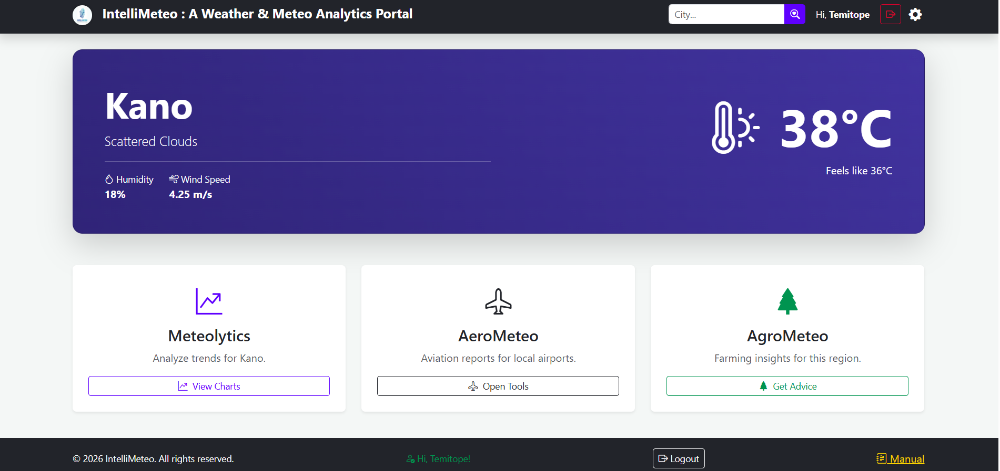
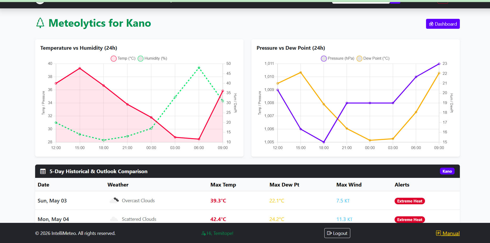
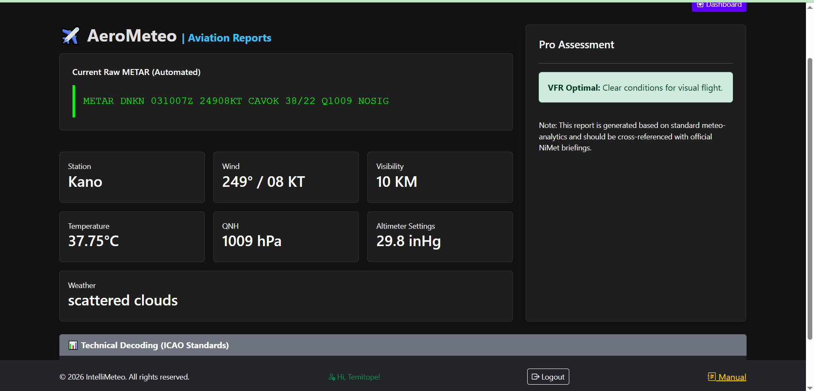
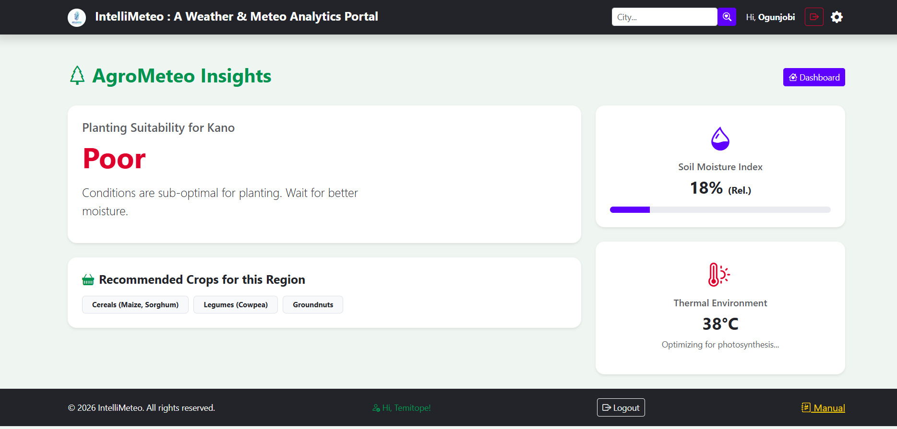

# 🌦️ IntelliMeteo – Nigerian Weather & Analytics Platform

## 🚀 Overview
IntelliMeteo is a comprehensive weather intelligence platform designed for both public users and meteorological professionals in Nigeria.

It combines real-time weather data with advanced analytics and domain-specific tools for aviation and agriculture.

---

## ✨ Key Features

- 🌍 Nationwide weather data visualization  
- 📊 Meteolytics dashboard (analytics & trend charts)  
- ✈️ AeroMeteo tools (METAR/SPECI/TAF/Warnings computations)  
- 🌱 AgroMeteo insights for agriculture  
- 🧠 Professional assessment module  

---

## 📸 Screenshots


*Landing page with weather overview*


*Main dashboard displaying weather data*


*Analytics dashboard for weather professionals*


*Aviation-focused meteorological computations*


*Agriculture-focused weather insights*

---

## 🛠️ Tech Stack

- Frontend: HTML, CSS, Bootstrap, JavaScript  
- Backend: PHP  
- Database: MySQL  
- API: OpenWeather API  

---

## 🔗 Live Demo

👉 https://nigeriawx.tecspectratechnologies.com/intellimeteo/index.php

> No login required — fully accessible demo

---

## 🎯 Why This Project Matters

This platform bridges the gap between raw weather data and actionable insights in Nigeria.

It is designed to support:
- Meteorologists in forecast validation  
- Aviation professionals with accurate weather computations  
- Agricultural stakeholders with climate-based decision-making  

Unlike generic weather apps, IntelliMeteo integrates analytics, domain-specific tools, and localized data interpretation.

---

## 🧠 System Design Highlights

- Modular architecture (Meteolytics, AeroMeteo, AgroMeteo, Forecast & Warnings, Computations, Assessment)  
- Integration with external weather APIs  
- Scalable structure for future expansion  
- Separation of concerns across modules  

---

## Create .env file using .env.example
- Configure database credentials
- Import database schema
- Run on local server (XAMPP/LAMP)

## 👨‍💻 Author

- Ogunjobi Temitope

- LinkedIn: https://www.linkedin.com/in/temitope-ogunjobi-4a5149a6/
- Portfolio: Coming soon

---
## ⚙️ Installation

```bash
git clone https://github.com/Topstar2ng/inTelliMeteo.git

